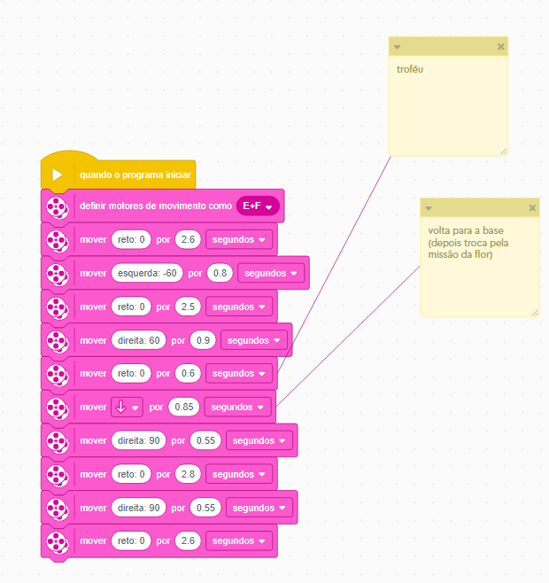

# Segunda progamação
### Na segunda programação iremos fazer a entrega do troféu e a experiencia emersiva. 
Primeiramente o “Vitor” irá sair de sua base levando junto com ele o troféu, Ana estará presa ao troféu assim já levamos ela junto, para encerrar ele irá retornar a base.  
### imagem da progamação
 

